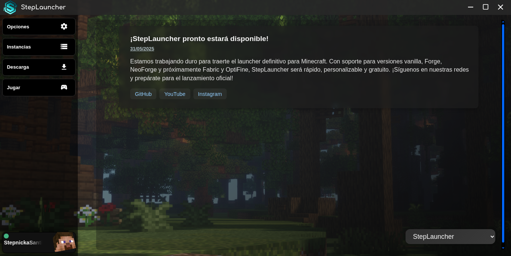
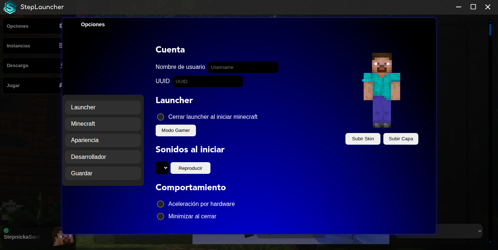
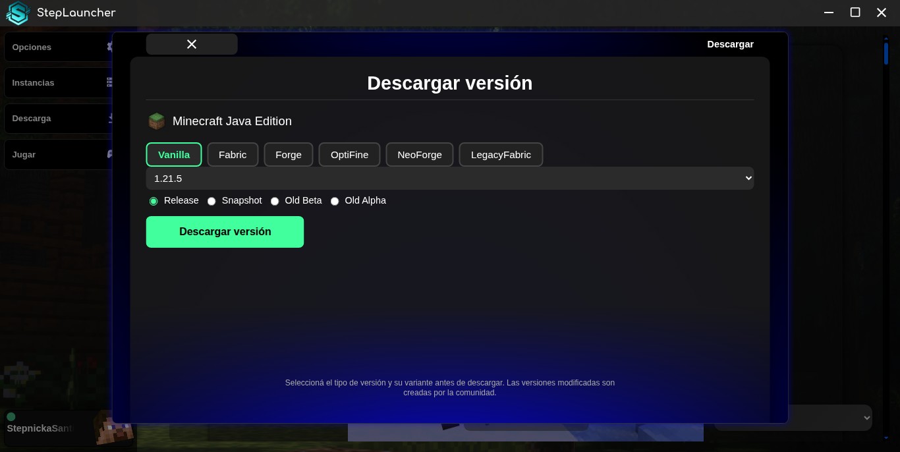
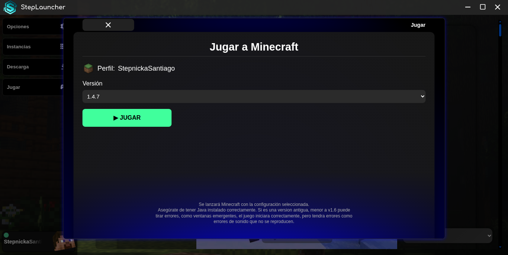

# StepLauncher

🚀 A powerful, customizable and modern Minecraft launcher built with web technologies.

StepLauncher is a fully featured Minecraft launcher designed for performance, flexibility, and user customization. Built with **JavaScript**, **CSS**, and **HTML** on top of **Electron**, it delivers a desktop-grade experience with complete control over versions, mods, themes, and optimization.

---

## ✨ Features

- ✅ **Cross-version support** — Launch any official Minecraft version: `release`, `snapshot`, `old_beta`, `old_alpha`.
- 🎨 **Full UI customization** — Modify background, music, themes, and interface behavior.
- ⚙️ **Mod support** — Load Minecraft with Forge, NeoForge, Fabric, and OptiFine.
- 🚀 **Performance auto-optimizer** — Detects hardware specs and adjusts game settings accordingly.
- 🌐 **Responsive interface** — Built with React and Tailwind CSS for a clean and dynamic UI.
- 🔐 **Privacy-respecting** — No telemetry, no tracking, and no forced accounts.

---

## 🖥️ Built With

- [Electron](https://www.electronjs.org/) – Desktop app framework  
- [JavaScript](https://developer.mozilla.org/en-US/docs/Web/JavaScript) – App logic  
- [HTML + CSS](https://developer.mozilla.org/en-US/docs/Web/HTML) – Interface  
---

<h3 align="center">🖼️ StepLauncher Previews</h3>

    
  

  
  
  

