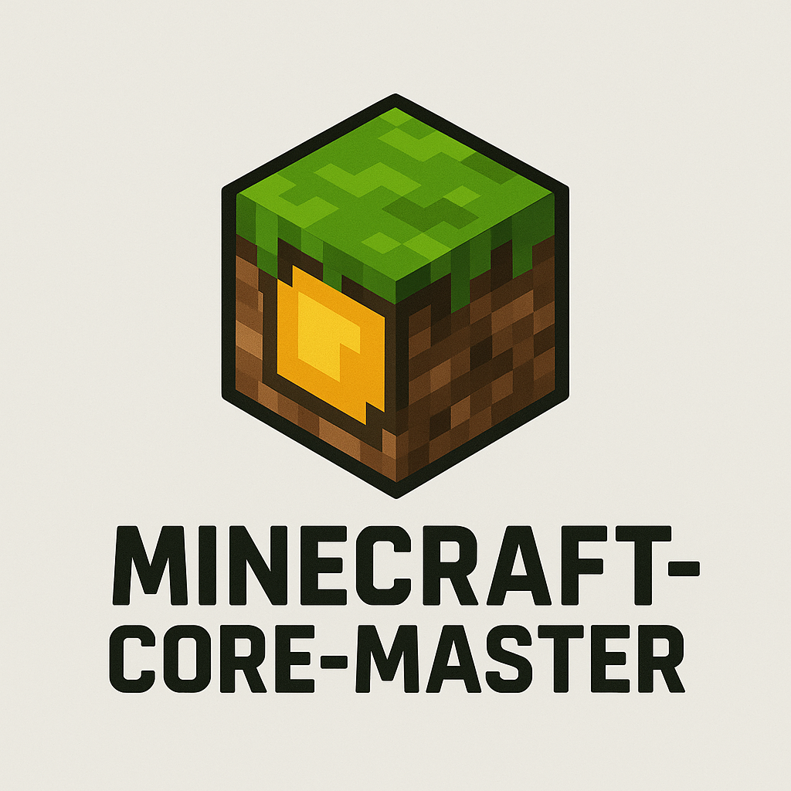

# Minecraft-Core-Master

**Minecraft-Core-Master** es una clase JavaScript para descargar versiones oficiales de Minecraft directamente desde los servidores de Mojang. Gestiona la descarga de:

* La versión específica de Minecraft (release, snapshot, old\_beta, old\_alpha, etc.)
* Librerías necesarias
* Assets (recursos gráficos y sonidos)
* Archivos nativos para el sistema operativo actual (Windows, Linux, macOS)
* Instalación opcional de Java (JVM)

Está diseñado para usarse en entornos Node.js, especialmente con Electron, usando eventos para informar progreso y errores, facilitando su integración en interfaces gráficas.

**Creado por:** NovaStep Studios — Desarrollo enfocado en mejorar la experiencia de usuario en apps Electron.

---

## Ejemplo básico: Descargar Minecraft

```js
const path = require("path");
const { MinecraftDownloader } = require("minecraft-core-master");

const downloadPath = path.join(__dirname, "minecraft");
const downloader = new MinecraftDownloader(downloadPath, true, "release");

downloader.on("progress", (msg) => console.log("[PROGRESO]", msg));
downloader.on("error", (err) => console.error("[ERROR]", err));
downloader.on("done", (msg) => console.log("[COMPLETADO]", msg));

downloader.download(); // Descarga la última versión release
```

---

## Parámetros de `new MinecraftDownloader(path, autoInstallJava, versionType)`

| Parámetro         | Tipo      | Obligatorio | Descripción                                                                                   |
| ----------------- | --------- | ----------- | --------------------------------------------------------------------------------------------- |
| `path`            | `string`  | Sí          | Ruta absoluta o relativa para instalar Minecraft, e.g. `"./minecraft"`.                       |
| `autoInstallJava` | `boolean` | Sí          | Si es `true`, instala automáticamente Java si no existe. Si `false`, se asume que Java está.  |
| `versionType`     | `string`  | Sí          | Tipo de versión por defecto para `.download()`: `"release"`, `"snapshot"`, `"old_beta"`, etc. |

---

## Métodos

### `.download(version?: string): Promise<void>`

* `version` (opcional): versión específica para descargar. Si se omite, descarga la última del tipo configurado.
* Devuelve una promesa que resuelve al terminar la descarga.

---

## Eventos disponibles

| Evento       | Parámetros | Descripción                                                 |
| ------------ | ---------- | ----------------------------------------------------------- |
| `"progress"` | `string`   | Estado actual del proceso: descarga de librerías, assets... |
| `"error"`    | `Error`    | Error ocurrido durante la descarga                          |
| `"done"`     | `string`   | Descarga completada exitosamente                            |

---

# Ejecutar Minecraft con `MinecraftEjecuting`

Además de descargar, el paquete permite lanzar Minecraft con la clase `MinecraftEjecuting`.

## Ejemplo básico para lanzar Minecraft

```js
const { MinecraftEjecuting } = require("minecraft-core-master");
const launcher = new MinecraftEjecuting();

const opts = {
  root: "./Minecraft",
  javaPath: "java",
  memory: { max: "6G", min: "1G" },
  window: { width: 854, height: 480, fullscreen: false },
  version: { versionID: "1.9", type: "release" },
  user: {
    name: "xxx_MataAbuelitas3000_xxx",
    skinPath: "./skin.png",
    capaPath: "./cape.png",
  },
};

launcher.launch(opts);

launcher.on("debug", (e) => console.log("[DEBUG]", e));
launcher.on("data", (e) => console.log("[DATA]", e));
```

---

## Parámetros de configuración para `launch(opts)`

| Propiedad  | Descripción                                  | Tipo                                                      | Obligatorio |
| ---------- | -------------------------------------------- | --------------------------------------------------------- | ----------- |
| `root`     | Ruta base de instalación de Minecraft        | `string`                                                  | Sí          |
| `javaPath` | Ruta al ejecutable Java (java o javaw)       | `string`                                                  | Sí          |
| `memory`   | Memoria mínima y máxima para JVM             | `{ min: string, max: string }`                            | No          |
| `window`   | Configuración de ventana                     | `{ width: number, height: number, fullscreen: boolean }`  | No          |
| `version`  | Versión y tipo de Minecraft a ejecutar       | `{ versionID: string, type: string }`                     | Sí          |
| `user`     | Información opcional de usuario (skin, capa) | `{ name?: string, skinPath?: string, capaPath?: string }` | No          |

---

## Eventos de `MinecraftEjecuting`

| Evento  | Parámetros | Descripción                        |
| ------- | ---------- | ---------------------------------- |
| `debug` | `string`   | Información detallada de ejecución |
| `data`  | `string`   | Datos adicionales durante el juego |

---

# Resumen técnico

* Obtiene versiones desde el manifiesto oficial de Mojang.
* Descarga client.jar, librerías, assets y nativos según versión y OS.
* Compatible con Windows, Linux y macOS, detectando el sistema automáticamente.
* Extrae archivos comprimidos (.zip, .tar.gz).
* Instala Java automáticamente si se configura.
* Permite personalizar memoria, ventana, versión y usuario al lanzar.
* Utiliza eventos para progreso, datos y errores.
* Próximamente soporte para modloaders como Forge, NeoForge, Fabric y OptiFine.

---

#### NovaStep Studios — Innovando la experiencia Minecraft en Electron
